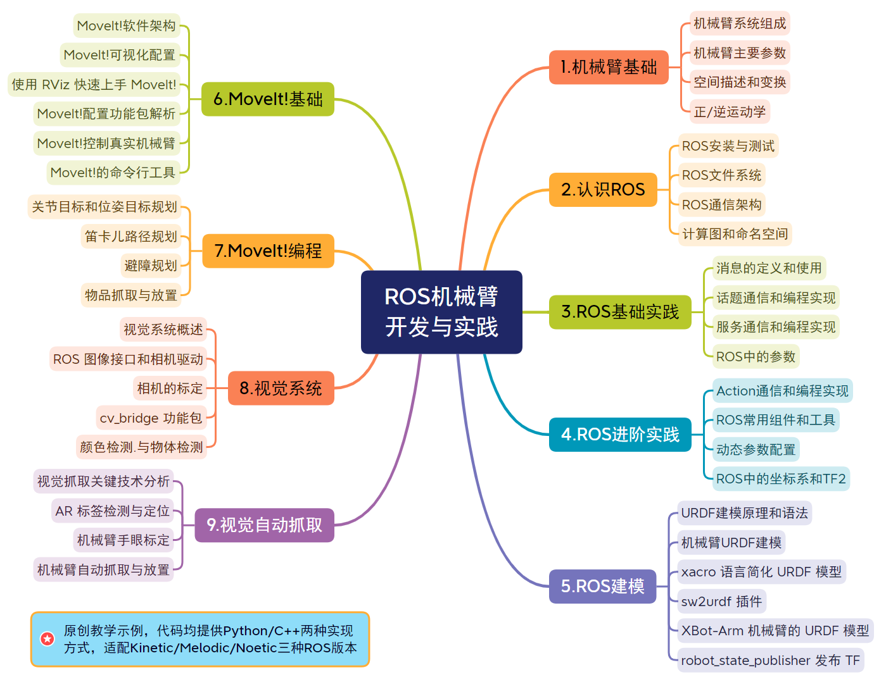
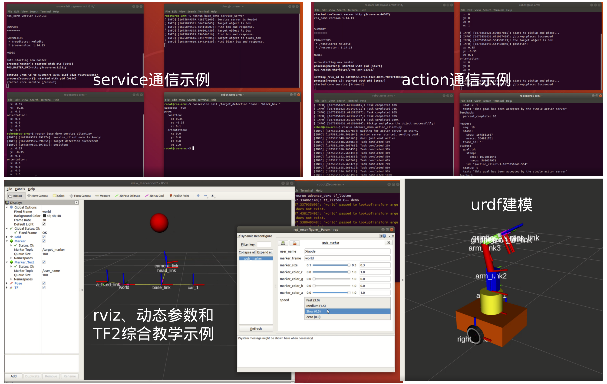
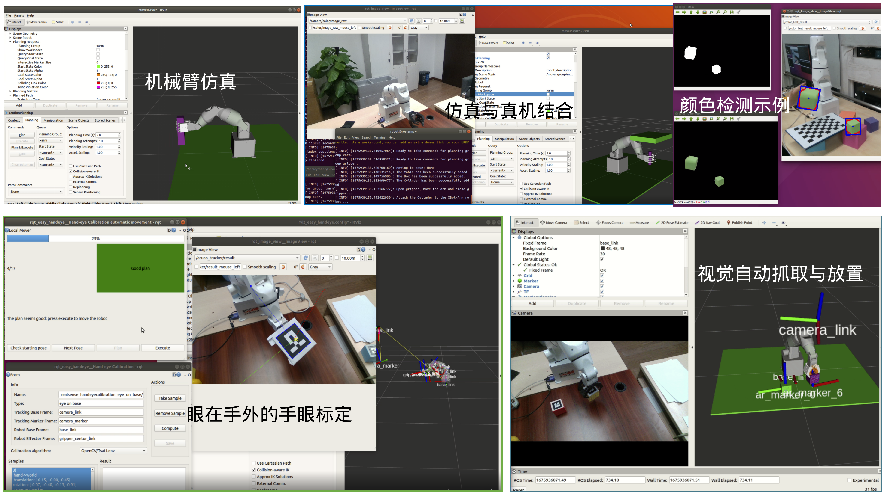

# 《ROS机械臂开发与实践》教材源码

## 前言

欢迎使用《ROS机械臂开发与实践》教材，本书基于“如何从零开始搭建机械臂的 ROS 控制系统”这一问题，由浅入深，由易到难，理论结合实践，详细介绍了 ROS 机械臂开发过程中使用的技术，并通过大量原创工程实例，帮助读者深入理解 ROS 框架，学会将 ROS 和 MoveIt!应用到具体的机器人开发实践中。


本书配套教学软件包、课后题解析、教学示例视频，以及一套包含PPT、讲稿和实验指导书的完整课程。本书正文讲解以 ROS-Melodic 版本为准，同时在开源仓库提供 Kinetic 和 Noetic 版本代码，便于读者测试。书中教学示例均提供 C++和 Python 两种编程实现方式，方便不同编程基础的读者入门和使用。



在学习中如果遇到问题，可在issues中提问，我们的团队会耐心回答。同时也欢迎各位老师与我们合作开展线上、线下教学。

## 功能包简介

本仓库是《ROS机械臂开发与实践》一书的教学代码包，所有示例均提供 Python 和 C++两种编程实现方式。 ros_arm_tutorials 各功能包简要说明如下：

| 软件包              | 内容                                                         |
| ------------------- | ------------------------------------------------------------ |
| base_demo           | 自定义消息和服务、topic发布/订阅、service服务端/客户端、参数操作示例 |
| advance_demo        | action 的定义和服务端/客户端、ROS 常用工具、动态参数配置节点和TF2示例 |
| myrobot_description | 三自由度机械臂和移动小车的URDF模型                           |
| darm                | Solidworks 导出的 XBot-Arm 机械臂原始 URDF 模型文件包        |
| xarm_description    | XBot-Arm 机械臂 URDF 模型文件包                              |
| urdf_demo           | URDF 模型和 robot_state_publisher 节点的使用示例             |
| xarm_driver         | XBot-Arm 真实机械臂驱动包                                    |
| xarm_moveit_config  | 使用 配置助手生成的 XBot-Arm 机械臂 MoveIt!配置和启动功能包  |
| xarm_moveit_demo    | 使用 MoveIt!的编程接口实现路径规划、避障以及机械臂的抓取和放置 |
| xarm_vision         | 摄像头启动、相机标定、颜色检测、AR标签识别、手眼标定、自动抓取与放置示例 |

除了 ros_arm_tutorials 中包含的功能包，本书中还使用了 find_object_2d、ar_track_alvar 和 easy_handeye等 ROS 开源功能包。

## 代码下载与编译

进入ROS工作空间的src目录，可以使用下面命令下载 GitHub 上对应分支的代码：

```
git clone -b kinetic-devel https://github.com/jiuyewxy/ros_arm_tutorials.git
```

或者使用下面命令下载 Gitee 上 melodic-devel 分支的代码：

```
git clone -b kinetic-devel https://gitee.com/xiao_yun_wang/ros_arm_tutorials.git
```


代码下载完成后，在终端依次输入以下命令安装依赖包并编译代码。

```
cd ..
rosdep install --from-paths src -i -y
sudo apt-get install ros-kinetic-moveit*
sudo apt-get install ros-kinetic-ar-track-alvar
catkin_make
```


代码编译通过后说明教学代码包已安装成功。

## 部分教学示例展示

下面是本书中部分教学示例的运行截图，完整内容和详细代码讲解可参考书籍。





## Copyright

